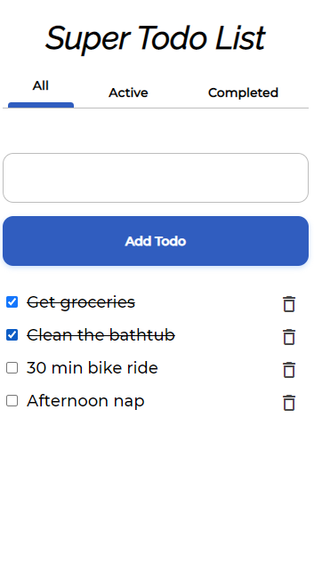

# Super Todo List

Created by Zachary Sarette

## About

A todo list app created with React JS

__Mobile Screen shot:__

__Desktop Screen shot:__

### The Process

  1. Used some tutorials to make a basic todo list without styling
    * Todolist state
    * add/remove and complete todos
    * 3 components
      * App
      * Todolist
      * Todo
  2. Added tab navigation
    * Added currentPage to state
    * Updated the UI based the currentPage
  3. Updated my CSS to use BEM
    * Went through each component starting at the top 
    * Refactored CSS splitting up the common styles
  4. Split code into more components and organized with folders
    * Buttons
    * Navbar
    * Header
    * Checkboxes
    * AddBar
    * const
    * utils
  5. Responsiveness and Accessibility
    * Used buttons
    * Used Semantic HTML tags
    * Background/Foreground contrast check
    * Using keyboard for entering todos
  6. Refactoring
    * Use of arrow functions throughout the code
    * Extract code into const and util libraries
    * Break up components into more pieces
    * Extract Text from UI into a const file
    * Use object destructuring

### What I learned

  I have a background with lots of vanillaJS, some Node and VueJS. 
  
  Using ReactJS felt very freeing compared to VueJS. You have to organize your code yourself. But it feels like writing with Javascript. And I really enjoyed the process. All of the concepts from VueJS and other frameworks are very similar. I need to study more react to get more proficient, but after doing this project, I feel very confident.

  I used Hooks and function components instead of class components for this project. I did some learning about class components, but when I saw that you can write less code with function components, I decided to go with that method for this simple app. 

  I also learned how to write JSX properly.

--- 

## Available Scripts

In the project directory, you can run:

### `yarn start`

Runs the app in the development mode. 
Open [http://localhost:3000](http://localhost:3000) to view it in the browser.

The page will reload if you make edits. 
You will also see any lint errors in the console.

### `yarn test`

Launches the test runner in the interactive watch mode. 
See the section about [running tests](https://facebook.github.io/create-react-app/docs/running-tests) for more information.

### `yarn build`

Builds the app for production to the `build` folder. 
It correctly bundles React in production mode and optimizes the build for the best performance.

The build is minified and the filenames include the hashes. 
Your app is ready to be deployed!

See the section about [deployment](https://facebook.github.io/create-react-app/docs/deployment) for more information.

### `yarn eject`

**Note: this is a one-way operation. Once you `eject`, you can’t go back!**

If you aren’t satisfied with the build tool and configuration choices, you can `eject` at any time. This command will remove the single build dependency from your project.

Instead, it will copy all the configuration files and the transitive dependencies (webpack, Babel, ESLint, etc) right into your project so you have full control over them. All of the commands except `eject` will still work, but they will point to the copied scripts so you can tweak them. At this point you’re on your own.

You don’t have to ever use `eject`. The curated feature set is suitable for small and middle deployments, and you shouldn’t feel obligated to use this feature. However we understand that this tool wouldn’t be useful if you couldn’t customize it when you are ready for it.
